# Logistix App - Complete Comprehensive Flow Chart

## 🚀 Complete App Architecture with All Features

```mermaid
flowchart TD
    %% App Entry Point
    START([App Launch]) --> SPLASH[Splash Screen]
    SPLASH --> INIT{App Initialized?}
    
    %% Initialization Flow
    INIT -->|No| ERROR[Error Screen]
    INIT -->|Yes| AUTH_CHECK{User Authenticated?}
    
    %% Authentication Flow
    AUTH_CHECK -->|No| ONBOARDING[Onboarding Flow]
    AUTH_CHECK -->|Yes| MAIN_APP[Main Application]
    
    %% Onboarding Flow
    ONBOARDING --> WELCOME[Welcome Screen]
    WELCOME --> APP_TOUR[App Tour]
    APP_TOUR --> FEATURE_INTRO[Feature Introduction]
    FEATURE_INTRO --> PERMISSIONS[Permission Requests]
    PERMISSIONS --> LOGIN[Login Screen]
    
    %% Login Flow
    LOGIN --> PHONE_INPUT[Enter Phone Number]
    PHONE_INPUT --> OTP_VERIFY[OTP Verification Screen]
    OTP_VERIFY --> NEW_USER{New User?}
    NEW_USER -->|Yes| CREATE_PROFILE[Create Profile Screen]
    NEW_USER -->|No| MAIN_APP
    CREATE_PROFILE --> MAIN_APP
    
    %% Main Application Structure
    MAIN_APP --> BOTTOM_NAV[Bottom Navigation]
    BOTTOM_NAV --> HOME_TAB[Home Tab]
    BOTTOM_NAV --> ORDERS_TAB[Orders Tab]
    BOTTOM_NAV --> TRACKING_TAB[Tracking Tab]
    BOTTOM_NAV --> PROFILE_TAB[Profile Tab]
    
    %% Home Tab Flow
    HOME_TAB --> HOME_DASHBOARD[Home Dashboard]
    HOME_DASHBOARD --> QUICK_ACTIONS[Quick Actions]
    QUICK_ACTIONS --> BOOK_NOW[Book Now]
    QUICK_ACTIONS --> SCHEDULE_BOOKING[Scheduled Booking]
    QUICK_ACTIONS --> RECURRING_BOOKING[Recurring Booking]
    QUICK_ACTIONS --> PACKAGE_DETAILS[Package Details]
    
    %% Booking Flow
    BOOK_NOW --> LOCATION_SELECTION[Location Selection]
    LOCATION_SELECTION --> PICKUP_LOC[Pickup Location Selection]
    PICKUP_LOC --> DROPOFF_LOC[Dropoff Location Selection]
    DROPOFF_LOC --> VEHICLE_SELECTION[Vehicle Selection]
    VEHICLE_SELECTION --> PACKAGE_INFO[Package Information]
    PACKAGE_INFO --> INSURANCE_OPTIONS[Insurance Options]
    INSURANCE_OPTIONS --> SPECIAL_REQUIREMENTS[Special Requirements]
    SPECIAL_REQUIREMENTS --> BOOKING_DETAILS[Booking Details Screen]
    BOOKING_DETAILS --> PAYMENT_METHOD[Payment Method Selection]
    PAYMENT_METHOD --> PAYMENT_CONFIRM[Payment Confirmation]
    PAYMENT_CONFIRM --> DRIVER_SEARCH[Driver Search Screen]
    DRIVER_SEARCH --> TRIP_DETAILS[Trip Details Screen]
    
    %% Orders Tab Flow
    ORDERS_TAB --> ORDERS_SCREEN[Orders Screen]
    ORDERS_SCREEN --> ORDER_FILTER{Order Type}
    ORDER_FILTER -->|Ongoing| ONGOING_ORDERS[Ongoing Orders]
    ORDER_FILTER -->|Completed| COMPLETED_ORDERS[Completed Orders]
    ORDER_FILTER -->|Cancelled| CANCELLED_ORDERS[Cancelled Orders]
    ORDER_FILTER -->|Scheduled| SCHEDULED_ORDERS[Scheduled Orders]
    ONGOING_ORDERS --> ORDER_DETAILS[Order Details]
    COMPLETED_ORDERS --> ORDER_DETAILS
    CANCELLED_ORDERS --> ORDER_DETAILS
    SCHEDULED_ORDERS --> ORDER_DETAILS
    ORDER_DETAILS --> TRIP_DETAILS
    
    %% Tracking Tab Flow
    TRACKING_TAB --> LIVE_TRACKING[Live Tracking Dashboard]
    LIVE_TRACKING --> ACTIVE_TRIPS[Active Trips]
    ACTIVE_TRIPS --> TRIP_ANALYTICS[Trip Analytics]
    LIVE_TRACKING --> DRIVER_LOCATION[Driver Location]
    DRIVER_LOCATION --> ETA_UPDATES[ETA Updates]
    LIVE_TRACKING --> ROUTE_OPTIMIZATION[Route Optimization]
    
    %% Profile Tab Flow
    PROFILE_TAB --> PROFILE_SCREEN[Profile Screen]
    PROFILE_SCREEN --> ACCOUNT_SETTINGS[Account Settings]
    PROFILE_SCREEN --> MY_WALLET[My Wallet]
    PROFILE_SCREEN --> DRIVER_MODE[Driver Mode]
    PROFILE_SCREEN --> SUPPORT[Support Center]
    
    %% Account Settings Flow
    ACCOUNT_SETTINGS --> SETTINGS_SCREEN[Settings Screen]
    SETTINGS_SCREEN --> THEME_SETTINGS[Theme Settings]
    SETTINGS_SCREEN --> NOTIFICATION_SETTINGS[Notification Settings]
    SETTINGS_SCREEN --> PRIVACY_SETTINGS[Privacy Settings]
    SETTINGS_SCREEN --> LANGUAGE_SETTINGS[Language Settings]
    SETTINGS_SCREEN --> ABOUT_APP[About App]
    SETTINGS_SCREEN --> LOGOUT[Logout]
    LOGOUT --> LOGIN
    
    %% Wallet Flow
    MY_WALLET --> WALLET_SCREEN[Wallet Screen]
    WALLET_SCREEN --> ADD_BALANCE[Add Balance]
    WALLET_SCREEN --> PAYMENT_HISTORY[Payment History]
    WALLET_SCREEN --> INVOICE_GENERATION[Invoice Generation]
    WALLET_SCREEN --> REFUND_REQUEST[Refund Request]
    WALLET_SCREEN --> PAYMENT_SETTINGS[Payment Settings]
    ADD_BALANCE --> PAYMENT_METHOD
    PAYMENT_HISTORY --> INVOICE_DETAILS[Invoice Details]
    REFUND_REQUEST --> REFUND_FORM[Refund Form]
    
    %% Driver Mode Flow
    DRIVER_MODE --> DRIVER_AUTH{Driver Authenticated?}
    DRIVER_AUTH -->|No| DRIVER_REGISTRATION[Driver Registration]
    DRIVER_AUTH -->|Yes| DRIVER_DASHBOARD[Driver Dashboard]
    DRIVER_REGISTRATION --> DRIVER_PROFILE[Driver Profile]
    DRIVER_PROFILE --> VEHICLE_MANAGEMENT[Vehicle Management]
    VEHICLE_MANAGEMENT --> DOCUMENT_UPLOAD[Document Upload]
    DOCUMENT_UPLOAD --> DRIVER_VERIFICATION[Driver Verification]
    DRIVER_VERIFICATION --> DRIVER_DASHBOARD
    DRIVER_DASHBOARD --> DRIVER_EARNINGS[Driver Earnings]
    DRIVER_DASHBOARD --> DRIVER_TRIP_HISTORY[Driver Trip History]
    DRIVER_DASHBOARD --> DRIVER_SETTINGS[Driver Settings]
    DRIVER_DASHBOARD --> ACTIVE_DELIVERIES[Active Deliveries]
    
    %% Support Flow
    SUPPORT --> SUPPORT_CENTER[Support Center]
    SUPPORT_CENTER --> HELP_CENTER[Help Center]
    SUPPORT_CENTER --> CONTACT_SUPPORT[Contact Support]
    SUPPORT_CENTER --> FAQ_SCREEN[FAQ Screen]
    SUPPORT_CENTER --> LIVE_CHAT[Live Chat]
    SUPPORT_CENTER --> SUPPORT_TICKET[Support Ticket]
    SUPPORT_CENTER --> FEEDBACK_FORM[Feedback Form]
    SUPPORT_CENTER --> REPORT_ISSUE[Report Issue]
    SUPPORT_CENTER --> KNOWLEDGE_BASE[Knowledge Base]
    
    %% Notification Management
    NOTIFICATION_SETTINGS --> NOTIFICATION_CENTER[Notification Center]
    NOTIFICATION_CENTER --> PUSH_NOTIFICATIONS[Push Notifications]
    NOTIFICATION_CENTER --> EMAIL_NOTIFICATIONS[Email Notifications]
    NOTIFICATION_CENTER --> SMS_NOTIFICATIONS[SMS Notifications]
    NOTIFICATION_CENTER --> NOTIFICATION_HISTORY[Notification History]
    NOTIFICATION_CENTER --> ALERT_PREFERENCES[Alert Preferences]
    
    %% Advanced Features
    SCHEDULE_BOOKING --> SCHEDULED_BOOKING_SCREEN[Scheduled Booking Screen]
    RECURRING_BOOKING --> RECURRING_BOOKING_SCREEN[Recurring Booking Screen]
    PACKAGE_DETAILS --> PACKAGE_DETAILS_SCREEN[Package Details Screen]
    
    %% Social Features
    PROFILE_SCREEN --> REFERRAL_SYSTEM[Referral System]
    PROFILE_SCREEN --> SHARE_TRIP[Share Trip]
    PROFILE_SCREEN --> RATE_DRIVER[Rate Driver]
    PROFILE_SCREEN --> DRIVER_REVIEWS[Driver Reviews]
    PROFILE_SCREEN --> COMMUNITY_FEATURES[Community Features]
    
    %% Error Handling
    ERROR --> ERROR_RETRY[Retry]
    ERROR --> ERROR_REPORT[Report Error]
    ERROR_RETRY --> INIT
    ERROR_REPORT --> SUPPORT_TICKET
    
    %% Map and Location Services
    LOCATION_SELECTION --> LOCATION_SEARCH[Location Search]
    LOCATION_SEARCH --> SEARCH_RESULTS[Search Results]
    LOCATION_SEARCH --> MAP_SELECTION[Map Selection View]
    MAP_SELECTION --> INTERACTIVE_MAP[Interactive Map]
    INTERACTIVE_MAP --> LOCATION_CONFIRMATION[Location Confirmation]
    LOCATION_CONFIRMATION --> VEHICLE_SELECTION
    
    %% Payment Processing
    PAYMENT_METHOD --> ADD_PAYMENT_METHOD[Add Payment Method]
    ADD_PAYMENT_METHOD --> CARD_DETAILS[Card Details]
    ADD_PAYMENT_METHOD --> UPI_PAYMENT[UPI Payment]
    ADD_PAYMENT_METHOD --> WALLET_PAYMENT[Wallet Payment]
    CARD_DETAILS --> PAYMENT_CONFIRM
    UPI_PAYMENT --> PAYMENT_CONFIRM
    WALLET_PAYMENT --> PAYMENT_CONFIRM
    
    %% Real-time Features
    TRIP_DETAILS --> LIVE_MAP_TRACKING[Live Map Tracking]
    TRIP_DETAILS --> DRIVER_LOCATION_SHARING[Driver Location Sharing]
    TRIP_DETAILS --> ETA_UPDATES_REAL[Real-time ETA Updates]
    TRIP_DETAILS --> DELIVERY_CONFIRMATION[Delivery Confirmation]
    TRIP_DETAILS --> TRIP_ANALYTICS_DETAILED[Detailed Trip Analytics]
    
    %% Styling for different categories
    classDef entryPoint fill:#e3f2fd,stroke:#1976d2,stroke-width:2px
    classDef authFlow fill:#e8f5e8,stroke:#388e3c,stroke-width:2px
    classDef mainFlow fill:#f3e5f5,stroke:#7b1fa2,stroke-width:2px
    classDef bookingFlow fill:#fff3e0,stroke:#f57c00,stroke-width:2px
    classDef driverFlow fill:#fce4ec,stroke:#c2185b,stroke-width:2px
    classDef paymentFlow fill:#e0f2f1,stroke:#00796b,stroke-width:2px
    classDef supportFlow fill:#f1f8e9,stroke:#689f38,stroke-width:2px
    classDef trackingFlow fill:#e8eaf6,stroke:#3f51b5,stroke-width:2px
    classDef errorFlow fill:#ffebee,stroke:#d32f2f,stroke-width:2px
    classDef missingFeature fill:#ffcdd2,stroke:#d32f2f,stroke-width:3px,stroke-dasharray: 5 5
    
    %% Apply styling
    class START,SPLASH,INIT,AUTH_CHECK entryPoint
    class ONBOARDING,WELCOME,APP_TOUR,FEATURE_INTRO,PERMISSIONS,LOGIN,PHONE_INPUT,OTP_VERIFY,NEW_USER,CREATE_PROFILE authFlow
    class MAIN_APP,BOTTOM_NAV,HOME_TAB,ORDERS_TAB,TRACKING_TAB,PROFILE_TAB mainFlow
    class HOME_DASHBOARD,QUICK_ACTIONS,BOOK_NOW,LOCATION_SELECTION,PICKUP_LOC,DROPOFF_LOC,VEHICLE_SELECTION,PACKAGE_INFO,BOOKING_DETAILS bookingFlow
    class DRIVER_MODE,DRIVER_AUTH,DRIVER_REGISTRATION,DRIVER_PROFILE,VEHICLE_MANAGEMENT,DOCUMENT_UPLOAD,DRIVER_VERIFICATION,DRIVER_DASHBOARD,DRIVER_EARNINGS,DRIVER_TRIP_HISTORY,DRIVER_SETTINGS,ACTIVE_DELIVERIES driverFlow
    class PAYMENT_METHOD,PAYMENT_CONFIRM,ADD_PAYMENT_METHOD,CARD_DETAILS,UPI_PAYMENT,WALLET_PAYMENT,PAYMENT_HISTORY,INVOICE_GENERATION,REFUND_REQUEST,PAYMENT_SETTINGS paymentFlow
    class SUPPORT,SUPPORT_CENTER,HELP_CENTER,CONTACT_SUPPORT,FAQ_SCREEN,LIVE_CHAT,SUPPORT_TICKET,FEEDBACK_FORM,REPORT_ISSUE,KNOWLEDGE_BASE supportFlow
    class LIVE_TRACKING,ACTIVE_TRIPS,TRIP_ANALYTICS,DRIVER_LOCATION,ETA_UPDATES,ROUTE_OPTIMIZATION,LIVE_MAP_TRACKING,DRIVER_LOCATION_SHARING,ETA_UPDATES_REAL,DELIVERY_CONFIRMATION,TRIP_ANALYTICS_DETAILED trackingFlow
    class ERROR,ERROR_RETRY,ERROR_REPORT errorFlow
    
    %% Mark missing features
    class ONBOARDING,WELCOME,APP_TOUR,FEATURE_INTRO,PERMISSIONS,SCHEDULE_BOOKING,RECURRING_BOOKING,PACKAGE_DETAILS,INSURANCE_OPTIONS,SPECIAL_REQUIREMENTS,TRACKING_TAB,LIVE_TRACKING,ACTIVE_TRIPS,TRIP_ANALYTICS,DRIVER_LOCATION,ETA_UPDATES,ROUTE_OPTIMIZATION,DRIVER_MODE,DRIVER_AUTH,DRIVER_REGISTRATION,DRIVER_PROFILE,VEHICLE_MANAGEMENT,DOCUMENT_UPLOAD,DRIVER_VERIFICATION,DRIVER_DASHBOARD,DRIVER_EARNINGS,DRIVER_TRIP_HISTORY,DRIVER_SETTINGS,ACTIVE_DELIVERIES,SUPPORT,SUPPORT_CENTER,HELP_CENTER,CONTACT_SUPPORT,FAQ_SCREEN,LIVE_CHAT,SUPPORT_TICKET,FEEDBACK_FORM,REPORT_ISSUE,KNOWLEDGE_BASE,NOTIFICATION_CENTER,PUSH_NOTIFICATIONS,EMAIL_NOTIFICATIONS,SMS_NOTIFICATIONS,NOTIFICATION_HISTORY,ALERT_PREFERENCES,REFERRAL_SYSTEM,SHARE_TRIP,RATE_DRIVER,DRIVER_REVIEWS,COMMUNITY_FEATURES,SCHEDULED_BOOKING_SCREEN,RECURRING_BOOKING_SCREEN,PACKAGE_DETAILS_SCREEN,ADD_PAYMENT_METHOD,CARD_DETAILS,UPI_PAYMENT,WALLET_PAYMENT,PAYMENT_HISTORY,INVOICE_GENERATION,REFUND_REQUEST,PAYMENT_SETTINGS,LIVE_MAP_TRACKING,DRIVER_LOCATION_SHARING,ETA_UPDATES_REAL,DELIVERY_CONFIRMATION,TRIP_ANALYTICS_DETAILED missingFeature
```

## 📊 Feature Implementation Status

### ✅ **Implemented Features (25+ screens)**

### ❌ **Missing Critical Features (40+ screens)**

## 🎯 Implementation Roadmap

### **Phase 1: Core Business Features (Weeks 1-4)**

### **Phase 2: User Experience (Weeks 5-8)**

### **Phase 3: Advanced Features (Weeks 9-12)**

## 🔧 Technical Architecture Improvements

### **Navigation Architecture**

### **State Management Enhancement**

## 📈 Success Metrics

### **User Experience Metrics**
- **App Launch Time**: < 3 seconds
- **Booking Completion Rate**: > 85%
- **User Retention**: > 70% (30 days)
- **Support Response Time**: < 2 hours

### **Business Metrics**
- **Driver Acceptance Rate**: > 90%
- **Payment Success Rate**: > 98%
- **Trip Completion Rate**: > 95%
- **Customer Satisfaction**: > 4.5/5

### **Technical Metrics**
- **App Crash Rate**: < 0.1%
- **API Response Time**: < 2 seconds
- **Real-time Updates**: < 5 seconds delay
- **Offline Functionality**: Basic features available

## 🚀 Next Steps

1. **Immediate Actions** (This Week)
   - Implement GoRouter for better navigation
   - Add missing BLoCs for state management
   - Create driver management screens
   - Implement payment system

2. **Short Term** (Next 2 Weeks)
   - Complete user onboarding flow
   - Add enhanced tracking features
   - Implement customer support system
   - Add notification management

3. **Medium Term** (Next Month)
   - Advanced booking features
   - Social features and ratings
   - Analytics dashboard
   - Performance optimization

4. **Long Term** (Next Quarter)
   - AI-powered features
   - Advanced analytics
   - Multi-language support
   - Enterprise features

This comprehensive diagram shows the complete vision for your Logistix app, highlighting both what you have and what needs to be built to create a world-class logistics platform. 